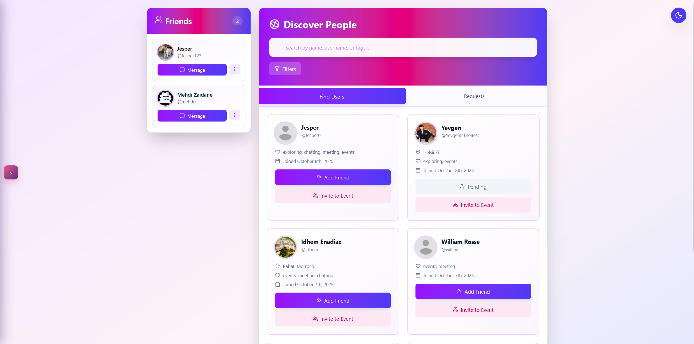
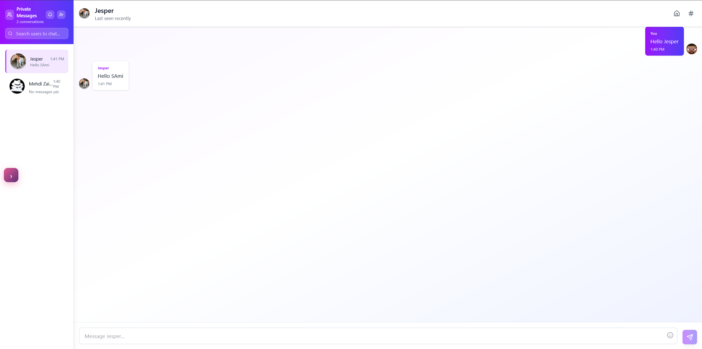
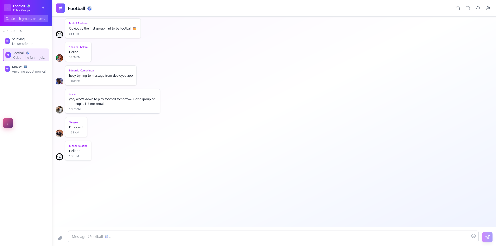
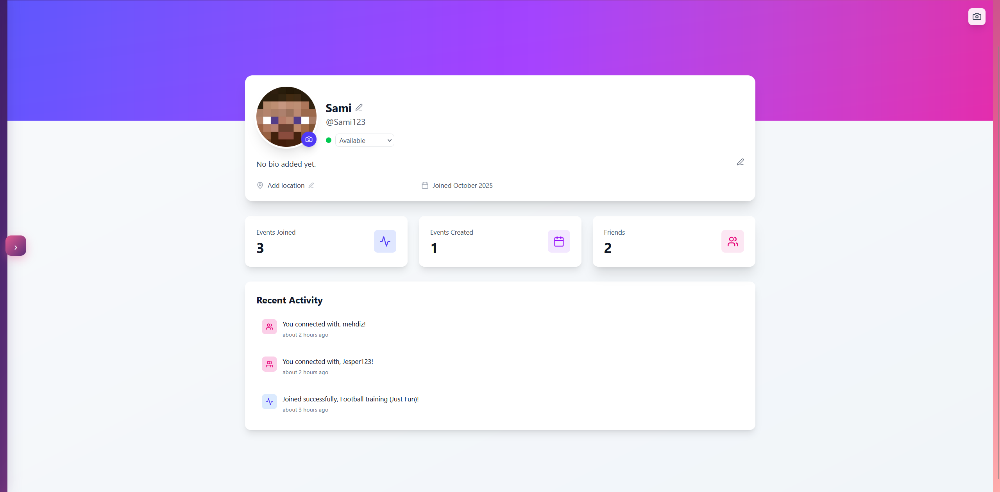
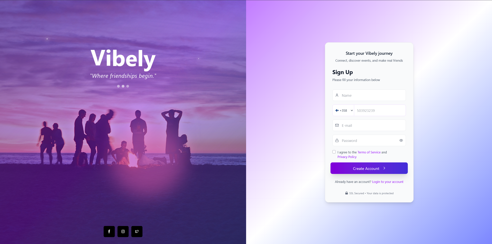
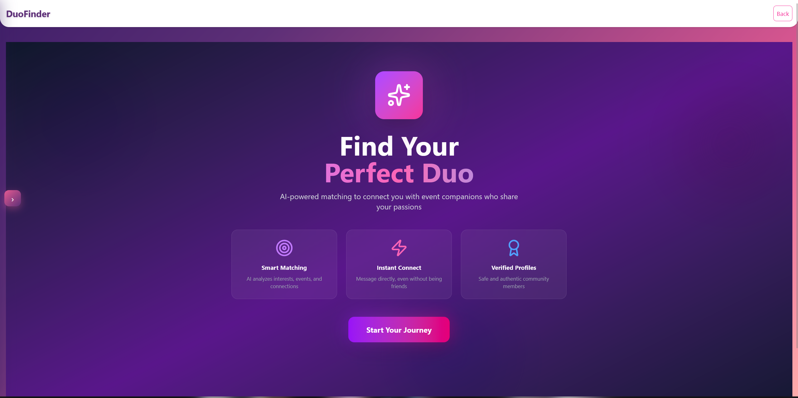
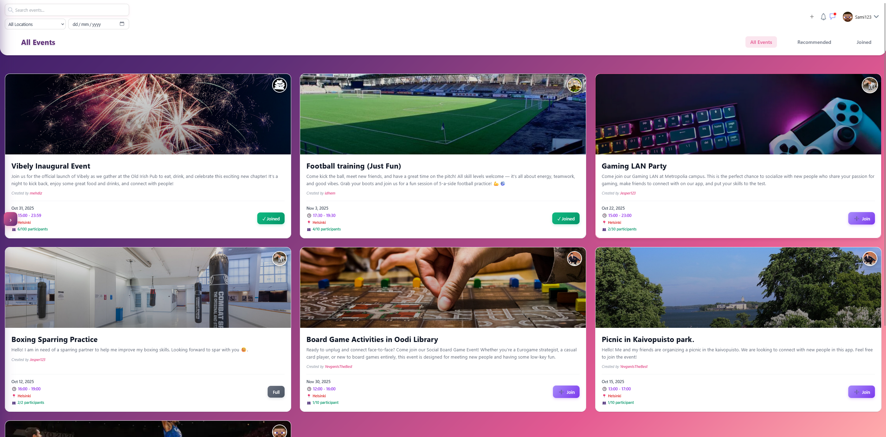

# 🎉 Vibely - Social Networking Platform

**Connect, Chat, and Discover Events in Real-Time**

[Features](#-features) • [Demo](#-demo) • [Tech Stack](#-tech-stack)

---

## 📖 About The Project

**Vibely** is a modern, full-stack social networking platform that combines real-time messaging with event management and AI-powered recommendations. Built with the MERN stack (MongoDB, Express, React, Node.js), Vibely enables users to connect with friends, discover events, and communicate seamlessly in both public and private chat rooms.

### Why Vibely?

- 🚀 **Real-Time Communication** - Instant messaging powered by Socket.IO
- 🎯 **Smart Recommendations** - AI-driven event suggestions using Google Gemini
- 🎨 **Beautiful UI/UX** - Modern design with smooth animations and gradients
- 📱 **Fully Responsive** - Works flawlessly on desktop, tablet, and mobile
- 🔐 **Secure Authentication** - JWT-based auth with bcrypt password hashing
- 👥 **Social Features** - Friend system, notifications, profile management

---

## ✨ Features

### 💬 **Real-Time Chat**

- **Private Messaging** - One-on-one conversations with friends
- **Public Chat Rooms** - Join or create group discussions
- **Online Status** - See who's online in real-time
- **Unread Indicators** - Never miss a message
- **Emoji Support** - Express yourself with categorized emojis
- **Message Search** - Find conversations quickly

### 🎪 **Event Management**

- **Browse Events** - Discover social, business, educational, and entertainment events
- **Smart Filters** - Search by location, date, and keywords
- **Join Events** - RSVP to events with capacity management
- **Create Events** - Host your own events with custom images and details
- **AI Recommendations** - Get personalized event suggestions based on your interests
- **Event Details** - View comprehensive information with host profiles

### 👤 **User Profiles**

- **Profile Customization** - Upload profile pictures and update bio
- **Friend System** - Send/accept friend requests
- **Activity Tracking** - View joined events and chat history
- **User Discovery** - Search and connect with other users

### 🔔 **Notifications**

- **Real-Time Alerts** - Instant notifications for friend requests and event updates
- **Notification Center** - Centralized hub for all alerts
- **Unread Badges** - Visual indicators for new notifications

---

## 🎬 Demo

### 🌐 Live Application

**Try it now:** [https://social-networking-app-cxqd.onrender.com/](https://social-networking-app-cxqd.onrender.com/)

### 📸 Screenshots

|                    People Page                    |                    Private Chat                     |                    Public Chat                    |
| :-----------------------------------------------: | :-------------------------------------------------: | :-----------------------------------------------: |
|  |  |  |

|                User Profile                |            Authentication            |                   DuoFinder                    |
| :----------------------------------------: | :----------------------------------: | :--------------------------------------------: |
|  |  |  |

|             Events Dashboard             |
| :--------------------------------------: |
|  |

---

## 🛠️ Tech Stack

### Frontend

- **React 18.2** - UI library with hooks
- **Vite** - Fast build tool and dev server
- **React Router DOM** - Client-side routing
- **Socket.IO Client** - Real-time WebSocket communication
- **Tailwind CSS** - Utility-first CSS framework
- **Lucide React** - Beautiful icon library
- **Framer Motion** - Animation library
- **date-fns** - Modern date utility library

### Backend

- **Node.js** - JavaScript runtime
- **Express 5** - Web application framework
- **MongoDB** - NoSQL database
- **Mongoose** - MongoDB object modeling
- **Socket.IO** - Real-time bidirectional communication
- **JWT** - JSON Web Token authentication
- **bcrypt** - Password hashing
- **Multer** - File upload handling
- **Google Gemini AI** - Event recommendation engine
- **Validator** - Input validation library

### Development Tools

- **ESLint** - JavaScript linting
- **Nodemon** - Auto-restart for Node.js
- **dotenv** - Environment variable management

---

[⬆ Back to Top](#-vibely---social-networking-platform)

